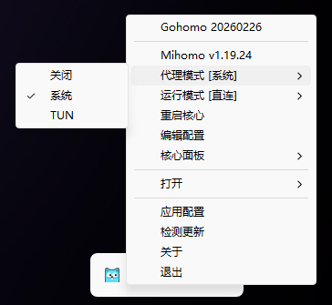

# Gohomo

**一个使用 Go 编写的 Mihomo 封装托盘工具，目前仅支持 Windows 平台。**

---

---

## 🚀 使用方法

1. 从 [Releases](https://github.com/junlongzzz/gohomo/releases/latest) 页面下载最新版本。

2. 下载 [Mihomo](https://github.com/MetaCubeX/mihomo/releases) 可执行文件，并准备配置文件 `config.yaml` (也支持 `.yml`
   格式)。

   > 配置文件可选，不存在时程序会默认创建可运行的最小配置文件，后续通过程序内的 `编辑配置` 功能再进行自定义编辑即可。

3. 将以上文件放在 `gohomo.exe` 同一目录下。

4. 运行 `gohomo.exe`，程序会在系统托盘中启动。

5. 开始使用 🎉

---

## ⚙️ 配置说明

应用配置文件为 `gohomo.yaml`，和 `gohomo.exe` 位于同一目录，也可通过程序内的 `应用配置` 功能进行编辑。

| 配置项                | 类型            | 说明                                                               | 默认值          |
|--------------------|---------------|------------------------------------------------------------------|--------------|
| `proxy-by-pass`    | array(string) | 直连（不走代理）的地址列表 （代理模式为系统时生效）                                       | 常见私有 IP 地址范围 |
| `proxy-mode`       | string        | 代理模式 close-关闭 system-系统 tun-TUN [**推荐通过程序内设置**]                  | `system`     |
| `core-log-enabled` | bool          | 是否将核心的运行日志写入文件（持久化）                                              | `false`      |
| `core-run-mode`    | string        | 核心运行模式 rule-规则 global-全局 direct-直连 [**推荐通过程序内设置**]               | `rule`       |
| `core-override`    | map           | 核心配置覆写，支持覆写或定义 `Mihomo` 的任何配置，参考 [覆写规则](./docs/core-override.md) | `{}`         |

> 配置文件的所有配置项更改后都是实时生效的，无需手动重启程序或核心。

---

## ⚠️ 注意事项

- 启用 **TUN 模式** 需要管理员权限运行程序。

---

Back to [README](./README.md)
